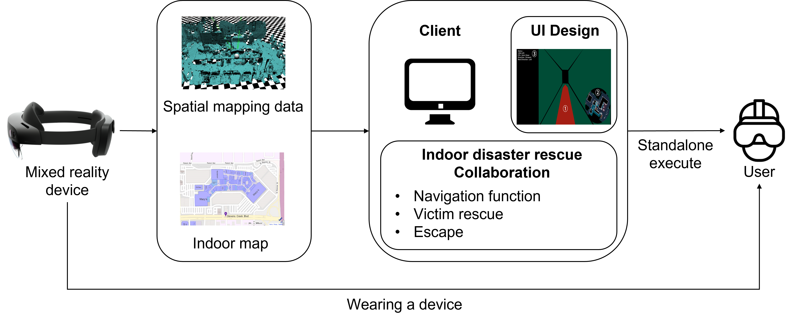
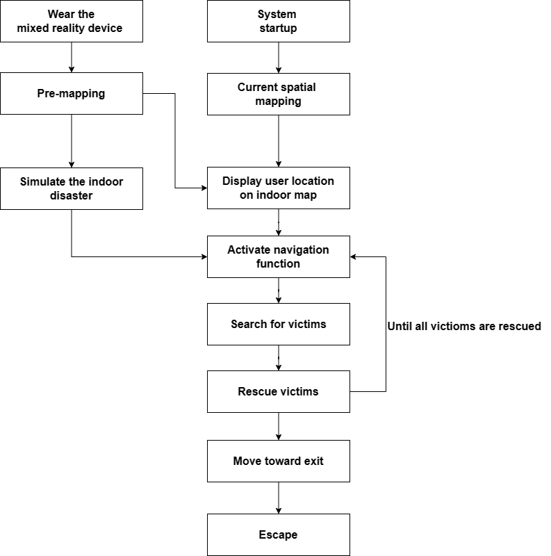
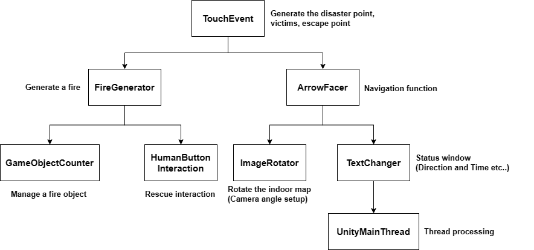
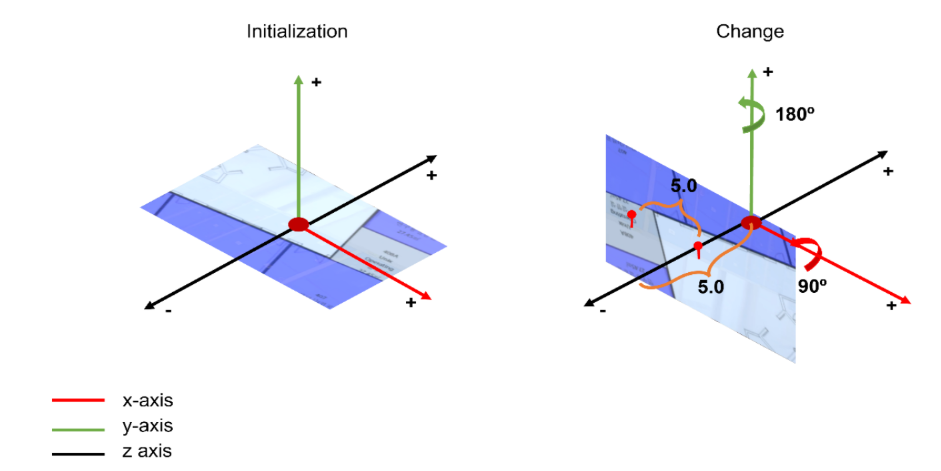
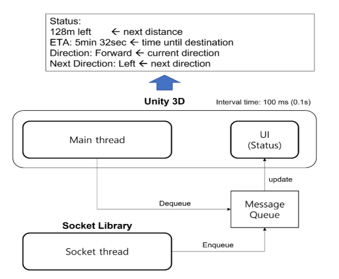
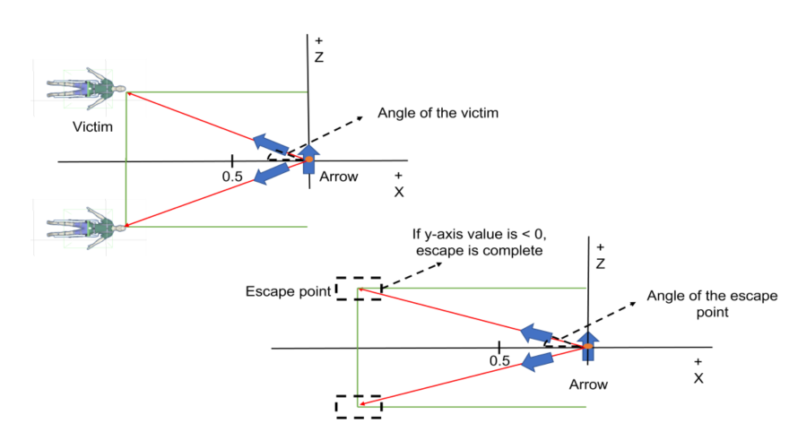
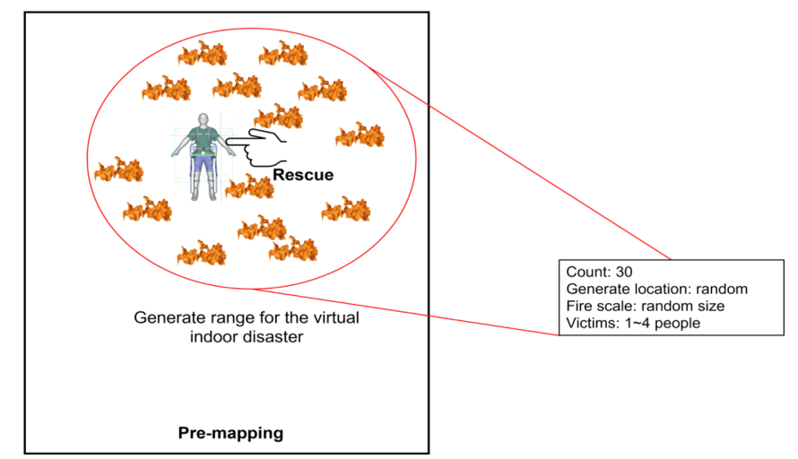
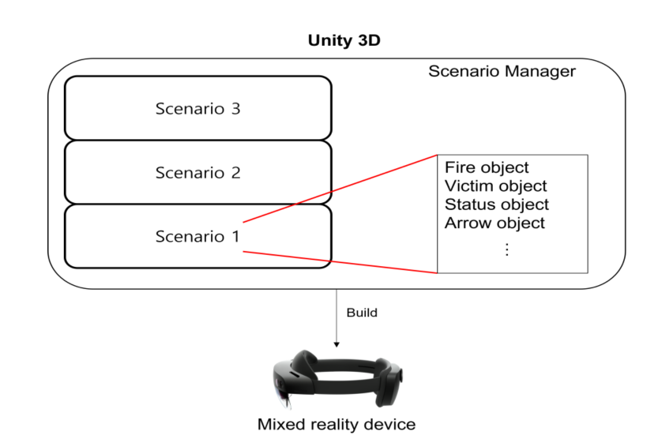

# 🚒 MR-Indoor-Disaster-Rescue

> HoloLens 2 기반 혼합현실(MR)을 활용한 실내 재난 구조 시뮬레이션 시스템

<br>

## 📌 목차

- [프로젝트 개요](#-프로젝트-개요)
- [팀 구성 및 역할](#-팀-구성-및-역할)
- [기술 스택](#-기술-스택)
- [배경 및 목적](#-배경-및-목적)
- [시스템 구조](#-시스템-구조)
- [주요 기능](#-주요-기능)
- [시뮬레이션 시나리오](#-시뮬레이션-시나리오)
- [실험 결과](#-실험-결과)
- [논문](#-논문)
- [실행 환경](#-실행-환경)
- [설치 및 실행 방법](#-설치-및-실행-방법)

<br>

## 📖 프로젝트 개요

<table>
  <thead>
    <tr>
      <th width="120" align="center">항목</th>
      <th>내용</th>
    </tr>
  </thead>
  <tbody>
    <tr>
      <td align="center">프로젝트명</td>
      <td>Design of a Mixed Reality System for Simulating Indoor Disaster Rescue</td>
    </tr>
    <tr>
      <td align="center">개발 기간</td>
      <td>2022.03 ~ 2022.08 <br> 석사 4학기</td>
    </tr>
    <tr>
      <td align="center">소속</td>
      <td>선문대학교 일반대학원 컴퓨터융합전자공학과 컴퓨터공학</td>
    </tr>
    <tr>
      <td align="center">논문 게재</td>
      <td>Applied Sciences, 2023, 13, 4418 (MDPI)</td>
    </tr>
    <tr>
      <td align="center">프로젝트 소개</td>
      <td>
        현대 건물의 대형화·복잡화로 실내 재난 위험이 증가하고 있으며, 구조 작업의 성공은 구조대의 복잡한 환경 대응 능력에 달려있다.<br>
        본 시스템은 증강 실내 지도와 MR 기술을 활용해 구조대가 다양한 환경 변수에 신속하게 대응하고 구조 활동을 수행할 수 있도록 돕는 혼합현실 기반 실내 재난 구조 시뮬레이션 시스템이다.<br>
        골든타임 5분을 2분으로 단축한 가상 재난 시나리오에서 평균 23.9%의 골든타임 단축 효과를 확인하였다.
      </td>
    </tr>
  </tbody>
</table>

<br>


## 🛠 기술 스택

| 분류 | 기술 |
|------|------|
| 개발환경 |  |
| 엔진 |  |
| SDK |  |
| 언어 |  |
| 디바이스 |  |
| GPU |  |

<br>

## 🎯 배경 및 목적

- 현대 건물의 대형화로 실내 재난(화재, 가스 누출 등) 위험 증가
- 구조대원은 복잡한 환경에서 다양한 작업을 수행해야 하므로 피로도 증가
- 기존 구조 훈련은 실제 환경과 다른 제한적인 경험만 제공
- 혼합현실 기술을 활용해 다양한 실내 재난 시나리오를 경험함으로써 구조 숙련도 향상
- 증강 실내 지도·탈출 내비게이션·조난자 위치 내비게이션을 통한 신속한 구조 활동 지원

<br>

## 🏗 시스템 구조

### System Overview



### System Flow



### System Functions



**주요 컴포넌트:**

| 컴포넌트 | 기능 |
|---|---|
| TouchEvent | 재난 지점, 조난자, 탈출 지점 생성 |
| FireGenerator | 가상 화재 생성 및 관리 |
| ArrowFacer | 내비게이션 화살표 방향 제어 |
| HumanButton Interaction | 조난자 구조 인터랙션 |
| ImageRotator | 실내 지도 회전 (카메라 각도 설정) |
| TextChanger | 상태창 방향·시간 표시 |
| UnityMainThread | 소켓 스레드 → 메인 스레드 큐 처리 |

<br>

## ✨ 주요 기능

### 1. 증강 실내 지도 (Indoor Map UI)



- MR 디바이스 내장 공간 매핑 센서로 현재 위치 수집
- 사용자 위치 아이콘을 실내 지도 위에 실시간 표시
- X축 90°, Y축 180° 회전으로 지도를 정면에서 볼 수 있도록 설계

### 2. 내비게이션 및 상태창 (Status UI)



- 조난자 위치까지의 거리·방향·예상 도착 시간 표시
- 화살표가 조난자 각도에 맞춰 회전하며 안내
- 구조 완료 후 탈출 지점으로 내비게이션 전환

### 3. 조난자 생성 (Victims Generate)



- 1~4명 랜덤 생성 (위치 무작위)
- 조난자 하단 버튼 클릭 시 구조 완료 처리
- 전원 구조 시 탈출 내비게이션 활성화

### 4. 화재 생성 (Fire Generate)



- Count 30, 위치·크기 랜덤으로 가상 화재 생성
- 예상치 못한 화재 발생 시 내비게이션 경로 자동 변경

### 5. 시나리오 매니저 (System Manager)



- 3가지 시나리오를 Unity 3D에서 빌드하여 HoloLens 2에 배포
- 사용자가 원하는 시나리오 선택 가능

<br>

## 🎬 시뮬레이션 시나리오

```
MR 시스템 시작
  → 조난자 탐지
  → 조난자 구조
  → 탈출로 이동
  → 탈출 완료
```

| 시나리오 | 평가 항목 | 설명 |
|---|---|---|
| S1 | 속도 | 1개 지점 재난 발생, 중앙 계단으로 탈출 |
| S2 | 정확도 | 2개 지점 재난 발생, 중앙 계단으로 탈출 |
| S3 | 예상치 못한 상황 대응 | 1개 지점 재난 발생, 복도 화재로 인해 다른 출구로 탈출 |

<br>

## 📊 실험 결과

**실험 환경:** 피실험자 10명 (남성 8명, 여성 2명), 골든타임 2분 기준

### 시나리오별 평균 탈출 시간

| 시나리오 | 평균 탈출 시간 | 골든타임 단축률 |
|:---:|:---:|:---:|
| S1 | 72.8초 | **39.3%** |
| S2 | 105.7초 | **11.9%** |
| S3 | 95.3초 | **20.6%** |
| **평균** | | **23.9%** |

### 참가자 개선 제안

| 개선 사항 | 응답 수 |
|---|:---:|
| 다중 디바이스 지원 | 3 |
| 가상 객체 겹침 문제 해결 | 2 |
| 조난자 구조 동작 개선 | 2 |
| 실내 공간 위치 오차 누적 해결 | 2 |
| 복잡한 다중 변수 시나리오 추가 | 1 |

> 🎥 실험 영상: [Google Drive](https://drive.google.com/drive/folders/1a0-uhdnLITE6DNcdxZUkXQWBCamKS7gN?usp=share_link)

<br>

## 📄 논문

> Chae, Y.-J.; Lee, H.-W.; Kim, J.-H.; Hwang, S.-W.; Park, Y.-Y.
> **Design of a Mixed Reality System for Simulating Indoor Disaster Rescue.**
> *Appl. Sci.* **2023**, *13*, 4418.
> https://doi.org/10.3390/app13074418

[📎 논문 보기](docs/mr_indoor_disaster_rescue.pdf)
<br>
[📎 해당 프로젝트와 연관된 석사 졸업 논문](docs/master_degree_paper.pdf)

<br>

## ⚙️ 실행 환경

### 개발 환경 (Laptop)

| 항목 | 사양 |
|---|---|
| CPU | AMD Ryzen 9 5900H 3.30 Hz |
| RAM | 16 GB |
| OS | Windows 11 Pro |
| GPU | NVIDIA GeForce RTX 3060 |
| Tool | Unity 2020.3.35 LTS |
| Framework | MRTK 2.7.3 |

### MR 디바이스 (Microsoft HoloLens 2)

| 항목 | 사양 |
|---|---|
| CPU | Qualcomm Snapdragon 850 |
| RAM | 4 GB |
| OS | Windows 10 Pro |
| Storage | 64 GB |
| Function | 6DOF, 96.1°FOV |

<br>

## 🚀 설치 및 실행 방법

### 1. 레포 클론

```bash
git clone https://github.com/GroovyCat/MR-Indoor-Disaster-Rescue.git
cd MR-Indoor-Disaster-Rescue
```

### 2. 개발 환경 설정

- Unity 2020.3.35f1 설치
- MRTK 2.7.3 패키지 임포트
- Visual Studio 2019 이상 설치

### 3. HoloLens 2 빌드 및 배포

1. Unity에서 Build Settings → Universal Windows Platform 선택
2. Build 후 Visual Studio에서 HoloLens 2에 배포
3. HoloLens 2 착용 후 시나리오 선택하여 실행
